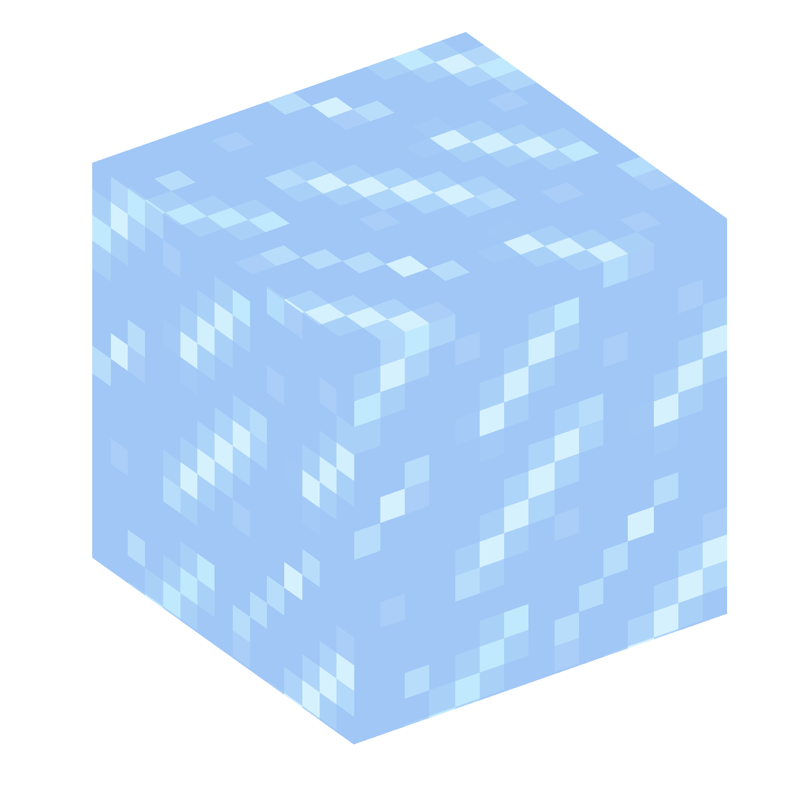

# WinterCraft Logo Generator

This repository contains a Python script that generates a **3D cube
block** with 3 visible textured faces (TOP, FRONT, RIGHT).\
The script was originally created to design the **logo for
WinterCraft**, using a custom ice texture.

## Example Output

The generated cube looks like this (using the ice texture):



## Features

-   Apply any texture image (PNG recommended).
-   Renders 3 visible faces of a cube (top, front, right).
-   Transparent background (ideal for logos or assets).
-   Orthographic projection (clean, isometric-like view).
-   Adjustable resolution, camera angles, and output size.

## Requirements

Install the dependencies:

``` bash
pip install matplotlib pillow numpy
```

## Usage

Run the script:

``` bash
python generate_block.py
```

By default, it loads `default_ice.png` and saves the block as
`block_textured.png`.

## Customization

-   Replace `default_ice.png` with any texture you like.
-   Change the constants in `generate_block.py` to adjust:
    -   Camera angles (`ELEV_ANGLE`, `AZIM_ANGLE`)
    -   Resolution (`FACE_RES`)
    -   Output file name (`OUTPUT_PATH`)

## Credits

-   Developed as part of the **WinterCraft project**.
-   Used to create the **official WinterCraft logo**.
